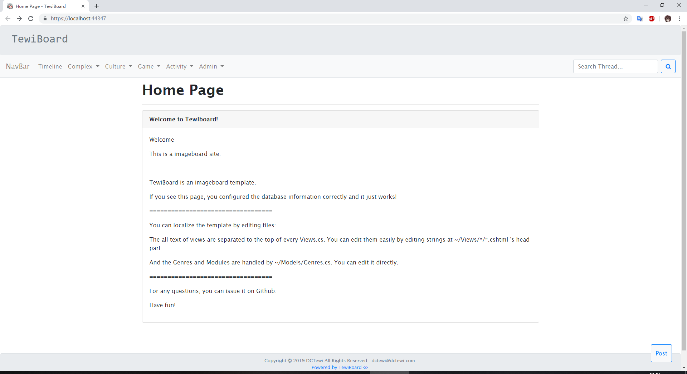
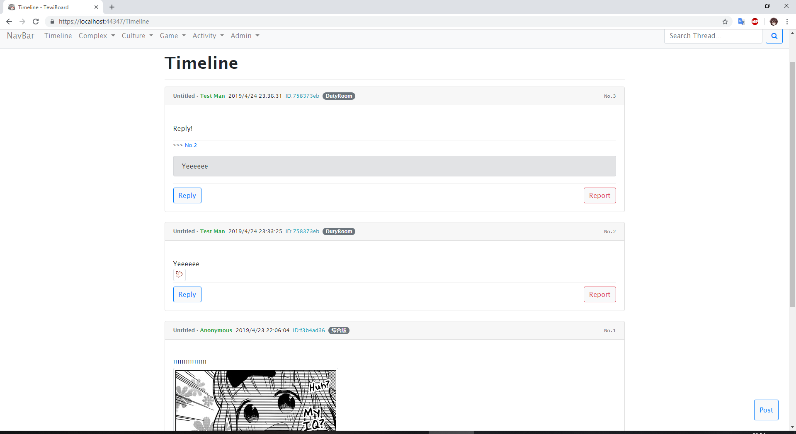
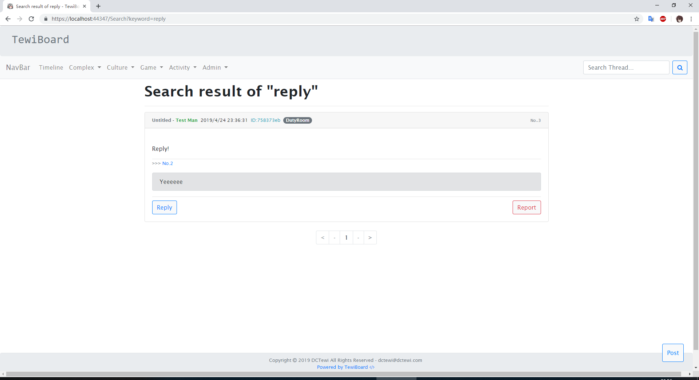
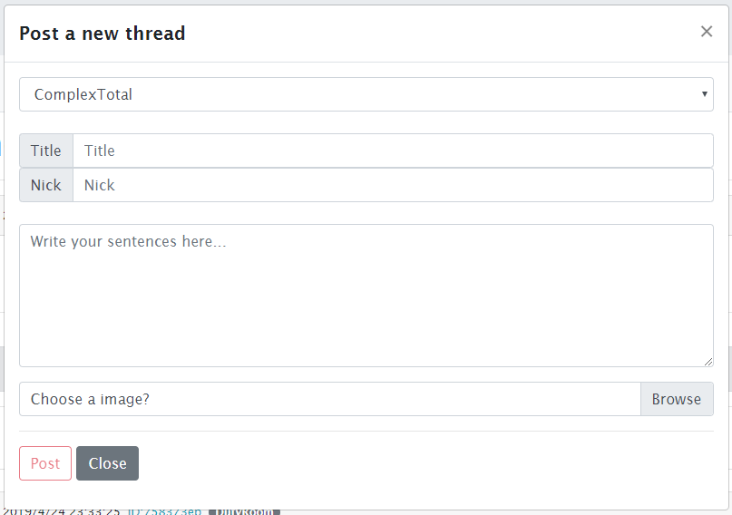
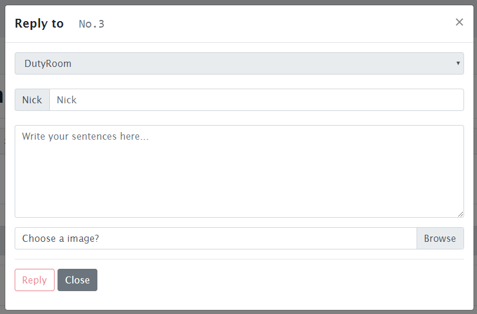

# TewiBoard

[For a English Version](./README.md)

一个基于ASP.NET Core的匿名版框架。

> **使用之前**
>
> 这个匿名版框架只是摸鱼的时候摸出来的。有很多地方的处理不够安全 ，如果你想使用本框架进行正式的或者长期的部署，请自己升级完善USERID生成器部分和删除、举报方法。

## 预览











## 特性

- 部署简单
- 本地化简单
- 基于ASP.Net Core 2.1或以上
- 基于 MySQL

## 部署

> 这是一种可能的部署的方法，测试于Ubuntu 16.04 LTS.
>
> 你需要一对SSL证书 .crt 和 .key 文件.

1. **创建一个管理匿名版的帐户**

   ```bash
   addusr tewiboard # Create user
   usermod -aG sudo tewiboard # Add user to sudo group
   su tewiboard # Switch to new user
   ```

2. **安装 .Net Core**

   ```bash
   cd ~ # cd the home path
   sudo wget https://dot.net/v1/dotnet-install.sh
   sudo bash ./dotnet-install.sh -c Current
   export PATH=$PATH:/home/tewiboard/.dotnet
   source /etc/profile
   ```

   输入 `dotnet --version` 如果可以正确看到版本信息，就可以进行下一步了。

3. **安装MySQL**

   ```bash
   sudo apt install mysql-server
   sudo apt install mysql-client
   sudo apt install libmysqlclient-dev
   ```

4. **创建所需的数据库**

   输入一下指令进入MySQL控制台：

   ```bash
   mysql -u root -p
   ```

   , 输入密码后，用类似于以下的指令创建所需的数据库和表：

   ```mysql
   create database tewiboard_sql;
   use `tewiboard_sql`;
   drop table if exists `card`;
   create table `card` (
   	`pid` bigint(12) not null auto_increment,
       `genre` varchar(30) default 'Complex',
       `module` varchar(30) default 'ComplexTotal',
       `replyid` bigint(12) default null,
       `replytop` bigint(12) default null,
       `title` varchar(30) default 'Untitled',
       `usernick` varchar(30) default 'Anonymous',
       `userid` tinytext default null,
       `isred` int default 0,
       `posttime` datetime default now(),
       `content` text not null,
       `imgurl` text default null,
       primary key (`pid`)
   )engine=InnoDB default charset=utf8mb4;
   exit;
   ```

5. **安装nginx**

   ```bash
   sudo apt install nginx
   ```

6. **自定义匿名版**

   你需要自定义以下文件：

   ```bash
   # ./Controllers/CardController.cs
   	`deletepwd` 变量，即删除所需密码
   # ./Models/Genres.cs
   	更改分类名字，以及添加一些红名key。
   # ./Views/*.cshtml
   	你可以通过改变每个.cshtml文件首部的变量来改变显示内容。
   # appsettings.json
   	完善MySQL设置。
   ```

7. **发布应用**

   将本项目中的` /TewiBoard` 内容复制到`~/TewiBoard`

   ```bash
   cd ~/TewiBoard
   dotnet publish -c Release
   scp -r ~/TewiBoard/bin/release/netcoreapp2.1/publish/* /var/www/tewiboard
   # Or ~/TewiBoard/bin/release/netcoreapp2.2/publish/*
   ```

8. **配置匿名版服务**

   添加一个service 文件:

   ```bash
   sudo vim /etc/systemd/system/tewiboard.service
   ```

   更改文件内容为:

   ```bash
   [Unit]
       Description=tewiboard
       [Service]
       WorkingDirectory=/var/www/tewiboard
       ExecStart=/home/TewiBoard/.dotnet/dotnet /var/www/tewiboard/TewiBoard.Web.dll
       Restart=always
       RestartSec=10    # Restart service after 10 seconds if dotnet service crashes
       SyslogIdentifier=dotnet-tewiboard
       User=www-data
       Environment=ASPNETCORE_ENVIRONMENT=Production
   
       [Install]
       WantedBy=multi-user.target
   ```

   启动服务：

   ```bash
   sudo systemctl enable tewiboard.service
   sudo systemctl start tewiboard.service
   sudo systemctl status tewiboard.service
   ```

   如果正确的启动了，就可以进行下一步了。

9. **配置nginx**

   设置 `/etc/nginx/site-available/default` :

   ```nginx
   server {
       listen 80;
       server_name YOUR.DOMAIN.COM;
       location / {
           proxy_pass http://localhost:5000;
           proxy_http_version 1.1;
           proxy_set_header Upgrade $http_upgrade;
           proxy_set_header Connection keep-alive;
           proxy_set_header Host $host;
           proxy_cache_bypass $http_upgrade;
           proxy_set_header   X-Forwarded-For $proxy_add_x_forwarded_for;
           proxy_set_header   X-Forwarded-Proto $scheme;
       }
   }
   ```

   , 设置 `/etc/nginx/proxy.conf` :

   ```nginx
   proxy_redirect          off;
   proxy_set_header        Host $host;
   proxy_set_header        X-Real-IP $remote_addr;
   proxy_set_header        X-Forwarded-For $proxy_add_x_forwarded_for;
   proxy_set_header        X-Forwarded-Proto $scheme;
   client_max_body_size    10m;
   client_body_buffer_size 128k;
   proxy_connect_timeout   90;
   proxy_send_timeout      90;
   proxy_read_timeout      90;
   proxy_buffers           32 4k;
   ```

   , 设置 `/etc/nginx/nginx.conf` :

   ```nginx
   user root;
   
   worker_processes 1;
   error_log /usr/local/nginx/logs/error.log info;
   worker_rlimit_nofile 65535;
   
   events
   {
       use epoll;
       worker_connections 65535;
   }
   
   http {
       include        /etc/nginx/proxy.conf;
       limit_req_zone $binary_remote_addr zone=one:10m rate=5r/s;
       server_tokens  off;
   
       sendfile on;
       keepalive_timeout   29; # Adjust to the lowest possible value that makes sense for your use case.
       client_body_timeout 10; client_header_timeout 10; send_timeout 10;
   
       upstream tewiboard{
           server localhost:5000;
       }
   
       server {
           listen     *:80;
           add_header Strict-Transport-Security max-age=15768000;
           return     301 https://$host$request_uri;
       }
   
       server {
           listen                    *:443 ssl;
           server_name               YOUR.DOMAIN.COM;
           ssl_certificate           YOUR_SSL_CRT.crt;
           ssl_certificate_key       YOUR_SSL_KEY.key;
           ssl_protocols             TLSv1.1 TLSv1.2;
           ssl_prefer_server_ciphers on;
           ssl_ciphers               "EECDH+AESGCM:EDH+AESGCM:AES256+EECDH:AES256+EDH";
           ssl_ecdh_curve            secp384r1;
           ssl_session_cache         shared:SSL:10m;
           ssl_session_tickets       off;
           ssl_stapling              on; #ensure your cert is capable
           ssl_stapling_verify       on; #ensure your cert is capable
   
           add_header Strict-Transport-Security "max-age=63072000; includeSubdomains; preload";
   		add_header X-Frame-Options DENY;
   		add_header X-Content-Type-Options "nosniff";
   
           #Redirects all traffic
           location / {
               proxy_pass http://tewiboard;
               limit_req  zone=one burst=10 nodelay;
           }
       }
   }
   ```

   最后重载nginx配置:

   ```bash
   sudo nginx -s reload
   ```

现在你以可通过域名访问你的匿名版了！

## 联系

- 作者 - 冻葱Tewi(dctewi@dctewi.com)

## 协议

